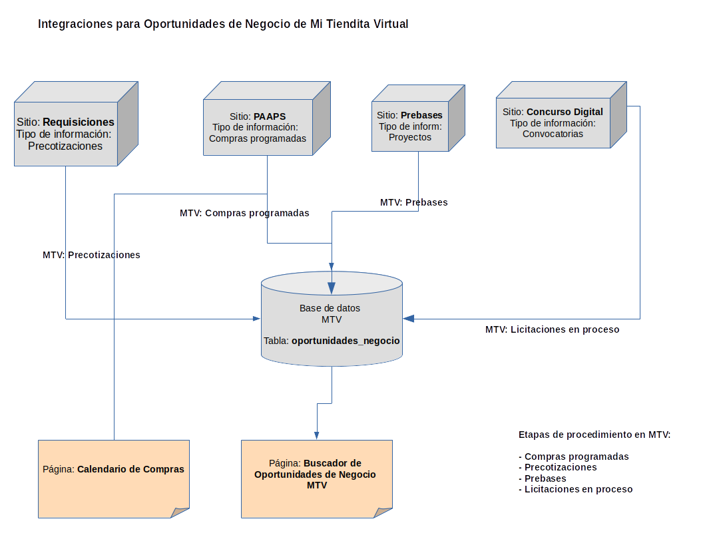

# Documentacion técnica de características por módulo de Mi Tiendita Virtual

## Catálogos

La carga inicial de los catálogos necesarios para el funcionamiento de MTV se realiza por medio de seeders:

- Catálogo de asentamientos: `database/seeders/CatAsentamientosSeeder.php`
- Catálogo de tipos de vialidades: `database/seeders/TiposVialidadSeeder.php`
- Catálogo de países: `database/seeders/CatPaisesSeeder.php`
- Catálogo de grupos prioritarios (perfil de negocio): `database/seeders/GruposPrioritariosSeeder.php`
- Catálogo de claves CABMS (y catálogos relacionados: categorias SCIAN, sectores): `database/seeders/CatCiudadanoCABMSSeeder.php`
  - Cargado a partir del archivo Excel _Catálogo Ciudadano de claves CABMS_ proporcionado por DEEM, el cual fue migrado a una tabla SQL que usa el seeder para cargar las tablas necesarias para MTV. El seeder a su vez carga un script sql que genera las tablas `cat_cabms`, `cat_categorias_scian` y `cat_sectores` para MTV. 
- Catálogos para oportunidades de negocio: 
  - Capítulos (grandes rubros de gastos): `database/seeders/CatCapitulosSeeder.php`
  - Instituciones compradoras: `database/seeders/CatUnidadesCompradorasSeeder.php`
    - Este catálogo es utilizado por Usuarios URG (urg_usuarios), Oportunidades de negocio (oportunidades_negocio), y Compras programadas (compras_procedimientos)
    - El catálogo cargado en ambiente de desarrollo por este seeder es diferente al de producción, ya que este catálogo se alimenta al momento de importar compras programadas, oportunidades de negocio y funcionarios del directorio. Durante la importación también se realiza una homologación para excluir en la medida de lo posible nombres de unidades compradoras duplicadas por variación en sus nombres (por ejemplo, Alcaldía Coyoacán = Alcaldía de Coyoacán o ALCALDIA COYOACAN) 
  - Tipos de contratación: `database/seeders/CatTiposContratacionSeeder.php`
  - Métodos de contratación: `database/seeders/CatMetodosContratacionSeeder.php`
  - Etapas de procedimientos: `database/seeders/CatEtapasProcedimientoSeeder.php`
  - Estatus de contratación: `database/seeders/CatEstatusContratacionSeeder.php` 
- Escritorio de Proveedor
  - Tareas de objetivos: `database/seeders/ObjetivosTareasSeeder.php`
  - Banners del carrusel de anuncios: `database/seeders/MTVBannersSeeder.php`

- Catálogos guardados en caché que deben refrescarse cada vez que son modificados los datos. Usar `Cache::forget('key')`:
  - cat_capitulos
  - cat_tipos_contratacion
  - cat_metodos_contratacion
  - cat_etapas_procedimiento
  - cat_estatus_contratacion
  - cat_unidades_compradoras
  - objetivos_tareas
  - mtv_banners

## Registro

### Registro de proveedores

- Registro de usuarios proveedor desde el registro de MTV. 
  - Para completar los datos (nombre, primer apellido, segundo apellido, fecha de nacimiento) de personas físicas se requiere consulta de datos mediante CURP a la API endpoint de Renapo 
  - MTV verifica si el RFC existe en Padrón de Proveedores (env variable `API_URL_PADRON_PROVEEDORES_CONSULTA_PERFIL_NEGOCIO`), si existe los datos son utilizados para completar el nuevo registro 
  - Cuando el proveedor existe en Padrón de Proveedores, es registrado con tipo de registro 2 (`id_tipo_registro` en tabla `personas`). Si no existe en PP el tipo de registro es 1 por default

- Registro de usuarios proveedor por API endpoint (POST) `/api/proveedores/register` (Ver `routes/api.php`)
    - Usar token de autenticación del usuario super administrador: `mtv-admin`
    - Endpoint devuelve el token de autenticación generado para el usuario registrado en MTV 
    - Ejemplo de payload (sustituir credenciales): Ver ejemplo en `docs/funcionalidad/registro_proveedor_payload_ejemplo.json`
  
### Registro de usuarios URG

- Registro de usuarios URG por API endpoint (POST) `/api/usuarios-urg/register` (Ver `routes/api.php`)
    - Usar token de autenticación del usuario super administrador: `mtv-admin`
    - Endpoint devuelve el token de autenticación generado para el usuario registrado en MTV
    - Ejemplo de payload:
      - `{
          "access_token":"", 
            "payload": {
              "nombre": "",
              "rfc": "",
              "password": "",
              "email": ""
          }
        }`

## Inicio de sesión

- Inicio de sesión de usuarios URG o proveedores con token de acceso:
  - `\urg-login?access_token=[token]` o `\login?access_token=[token]`

- Un usuario de MTV puede tener los siguientes roles:
  - `proveedor` - Rol de proveedor registrado en MTV
  - `urg` - Rol de usuario de URG registrado en MTV
  - `admin` - Rol de usuario con permisos de administrador (algunas URG podrían tener este rol también)
  - `mtv-admin` - Rol de super usuario con permisos para el Panel de administración de MTV

### Inicio de sesión de proveedores

`[url_mtv]/login`

- Al momento de iniciar sesión, si se detecta que existe una cuenta en Padrón de Proveedores, se actualizan los datos del proveedor en MTV con los provenientes de PP. Si el API devuelve también la contraseña, y el proveedor no existen en MTV, se crea una nueva cuenta (Ver `app/Http/Controllers/Auth/AuthenticatedSessionController.php > store`)

### Inicio de sesión de usuarios URG

`[url_mtv]/urg-login`

- Al momento de iniciar sesión, si se detecta que existe una cuenta válida en el sistema Acceso único, se crea la cuenta en MTV con el rol de `urg` con los datos devueltos por el endpoint del API (Ver archivo .env)  

## Registro de productos

- Opción de registro manual:
  - Permite registrar un producto en cuatro pasos, mediante los cuales se van completando la información del producto. 
  - La tabla de `productos` tiene un campo `registro_fase` para identificar la fase de registro en la que se encuentra un producto. Si por alguna razón el registro se interrumpe, el producto queda incompleto y será necesario depurarlo después para que no ocupe espacio adicional en la tabla de productos. La plataforma filtra los productos incompletos y no los muestra entre los resultados del buscador de productos. 
- Opción de Carga masiva:
  - Permite registrar varios productos mediante importación desde un archivo de Excel basado en una plantilla que se proporciona al usuario para su llenado (descargable desde la interfaz de usuario).
    - La plantilla Excel se encuentra en `storage/app/public/plantillas/productos_carga_masiva.xlsx`
  - La tabla de `productos` tiene un campo `es_importado` para identificar si el producto se creó mediante carga masiva.

## Perfil de Negocio
 
- El Perfil de Negocio puede presentarse en las siguientes modalidades:
  - Como proveedor logueado, desde el menú de usuario (derecha superior), _Mi perfil_. Esta página muestra el perfil editable del proveedor logueado.
  - Como vista de datos no editable de otro proveedor (diferente al logueado) 
    - La opción _Solicitar información_ en esta página sólo funciona si el usuario tiene un rol de URG. La información del mensaje enviado de URG a proveedor se guarda en las tablas `messenger_messages`, `messenger_participants`, `messenger_threads` (Paquete usado: https://github.com/cmgmyr/laravel-messenger). Además, el mensaje es enviado por correo electrónico (de la URG al proveedor).     

## Catálogo de productos

- El Catálogo de productos puede presentarse en las siguientes modalidades:
  - Mi Tiendita Virtual (menú principal), muestra el catálogo de productos del proveedor logueado.
  - Desde la página de datos del proveedor, en la sección _Catálogo digital_, el botón _Catálogo_ lleva al catálogo del proveedor correspondiente. Para Ver estas páginas no es necesario estar logueado.    

## Buscador de productos y proveedoes

- El buscador de productos y proveedores se encuentra en una misma página a la que se accede por medio del menú principal _Tienditas Virtuales > Catálogo de productos_  

### Buscador de productos

- Página pública, accesible para todo tipo de usuarios (proveedores, URG, etc.)

### Buscador de proveedores

- Página pública, accesible para todo tipo de usuarios (proveedores, URG, etc.)
- La vista de resultados de esta página consulta los estatus de constancias desde Padrón de Proveedores 

### Favoritos (página)

- Página accesible únicamente para usuarios con rol de URG.

## Buscador de oportunidades

- Durante la fase de desarrollo, para cargar la información del buscador de oportunidades, como por ejemplo registros de convocatorias y prebases, se utilizaron seeders (`database/seeders/OportunidadesNegocioSeeder.php`)
- En producción se ejecutan comandos (ver `app/Console/Commands` y `app/Console/Kernel.php`) para importar los datos para Oportunidades de negocio (ver API endpoint en archivo .env)
  - La importación de datos de convocatorias se realiza una vez al día (4 am) y consulta las convocatorias abiertas 
  - La importación de datos de prebases se realiza una vez al día (8 am) y consulta todos los proyectos de prebases existentes 
    - *Pendiente:* Solamente nos proporcionó un API endpoint de desarrollo y se indicó que por el momento producción no está devolviendo datos, aunque la estructura de los datos devueltos es la misma para ambos ambientes
  - La importación de datos de precotizaciones se realiza cada trimestre desde el API endpoint del sistema de requisiciones. Ya que las precotizaciones devueltas no tienen nombre de la unidad compradora, se utiliza la dependencia "DIRECCION GENERAL DE RECURSOS MATERIALES Y SERVICIOS GENERALES" al importarlas como Oportunidades de negocio  
  - La importación de datos de compras programadas se realizó una vez para el 2023
  
- Para que estos seeders alimenten la base de datos de MTV con oportunidades de negocio se debe correr un proceso periódicamente (cronjob o scheduled task) que los ejecute.
- El siguiente diagrama muestra el flujo de información desde las fuentes de datos para oportunidades de negocio de MTV:

- Cada oportunidad de negocio tiene un identificador único en MTV (ver tabla `oportunidades_negocio`) que sirve a su vez también para permitir a los proveedores guardar oportunidades (como favoritos en la tabla `markable_bookmarks`).     

### Notificaciones (página)

## Calendario de compras

- Durante la fase de desarrollo, para cargar la información del Calendario de compras se utilizó un seeder (`database/seeders/ComprasProcedimientosSeeder.php`) con un importador desde un archivo de Excel
  - La información de prueba cargada por el seeder para el Calendario de compras durante la fase de desarrollo proviene del archivo CSV en `database/data/compras_procedimientos_2022.csv` proporcionado por DEEM.
- En producción la importación de compras programadas desde PAAAPS se realizó una vez para el 2023 con el mismo comando que importa Oportunidades de negocio de compras programadas (Ver `app/Console/Commands/ImportaComprasProgramadas.php`) 
- La página del Calendario de compras presenta la información calculada y filtrada por año actual a partir de la tabla `compras_procedimientos`, la cual tiene que ser alimentada previamente con datos actualizados. 
[Insertar diagramas de flujo de información entre sistemas]

### Detalle de compras

- La página de detalle de compras (desde Calendario de compras) presenta los procedimientos de una institución compradora del año actual, filtro que se aplica sobre la tabla `compras_procedimientos`

## Preguntas frecuentes

- Para cargar la información de la página de Preguntas frecuentas se utiliza un seeder (`database/seeders/PreguntasFrecuentesSeeder.php`) con un importador desde un archivo de Excel.
- La información cargada por el seeder para el Preguntas frecuentes durante la fase de desarrollo proviene del archivo CSV en `database/data/PREGUNTAS FRECUENTES MTV.xlsx` proporcionado por DEEM

## Directorio CDMX

- Durante la fase de desarrollo, para cargar la información del Directorio CDMX se utiliza un seeder (`database/seeders/DirectorioCdmxSeeder.php`) con un importador desde un archivo de Excel
- En producción la importación de datos de funcionarios desde el sistema de Acceso único se realiza cada trimestre (ver comando `app/Console/Commands/ImportaDirectorioCdmx.php` y tarea programada)

## Escritorio del proveedor

- El escritorio carga tareas de objetivos de la base de datos. Las tareas se pueden crear, editar o eliminar en el módulo de administración de MTV 
- Los banners informativos se cargan desde la base de datos y se pueden modificar desde el módulo administrador, por default las imágenes de los banners se almacenan en la carpeta `storage/app/public/images/banners`

## Módulo de administración de MTV

- El módulo de administración de MTV permite consultar y mantener algunos catálogos de MTV:
  - Funcionarios del Directorio CDMX
  - Información de preguntas y respuestas de la página de Preguntas frecuentes
  - Unidades compradoras
  - Tareas de objetivos del escritorio de proveedor
  - Banners del escritorio de proveedor
  - Usuarios URG
- Para acceder al módulo de administración de MTV usar el siguiente path: `/admin/login`

## Mensajes de Email enviados desde MTV

- Las clases de correos y notificaciones de MTV se encuentran bajo `app/Mail` y `app/Notifications`. Todas las plantillas Blade en `resources/views/emails`
- Después de crear la cuenta en MTV (registro de proveedor). Ver `app/Http/Controllers/RegistroMTVController.php : storeRegistroCreaCuenta`
- Al solicitar restablecemiento de contraseña en url `/forgot-password`. Ver `app/Http/Controllers/Auth/PasswordResetLinkController.php : store`
- Después de reestablecer la contraseña en url `/reset-password/{token}`. Ver `app/Http/Controllers/Auth/NewPasswordController.php : store`
- Al solicitar información en la página de producto o perfil de negocio de proveedor (opción habilitada sólo para usuarios URG). Se envía un mensaje al correo del proveedor y otro al correo del usuario URG logueado
- Al enviar un mensaje por medio del formulario de contacto de la página de Preguntas frecuentes `/preguntas-frecuentes`. Se envía un correo a la dirección de correo proporcionada por el usuario en el formulario, y se envía otro correo a la cuenta de administrador de MTV (ver correo configurado, variable `MAIL_FROM_ADDRESS`, en el archivo .env )
- Después del registro exitoso de cuenta de Unidad Responsable de Gasto se envía un correo al usuario. Ver `RegistroURGController.php : store`